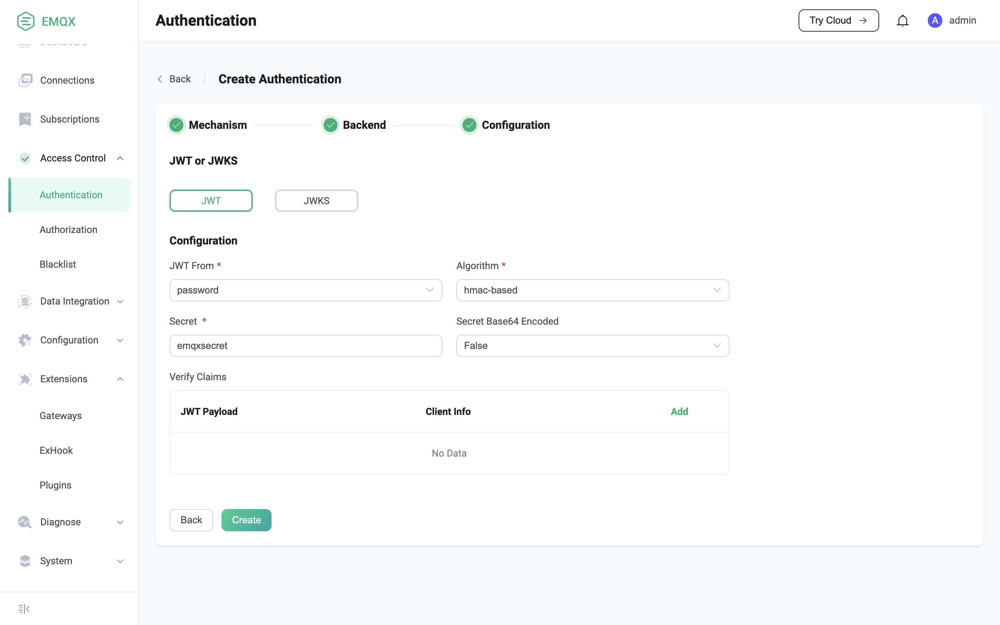

# JWT 认证

[JWT](https://jwt.io/) 是一种基于 Token 的认证机制。它不需要服务器来保留客户端的认证信息或会话信息。

## 认证原理

客户端在连接请求中携带 JWT，EMQX 则使用预先配置的密钥或公钥对 JWT 签名进行验证。如果用户配置了 JWKS 端点，则 JWT 认证器将使用从 JWKS 端点查询到的公钥列表对 JWT 签名进行验证。如果签名验证成功，则 JWT 认证器会继续检查 Claims。如果存在 `iat`、`nbf` 或 `exp` 等 Claims，JWT 认证器会主动根据这些 Claims 检查 JWT 的合法性。除此之外，我们也允许用户自己指定一些额外的 Claims 检查。只有签名验证与 Claims 检查一并通过，客户端才能最终被允许登录。

## 常见用法

JWT 认证器本质上只是检查了 JWT 的签名，也就是说 JWT 认证器并不能对客户端身份的合法性提供担保。

常见的用法是用户部署一个独立的认证服务器，客户端首先访问该认证服务器，由该认证服务器验证客户端的身份，并为合法的客户端签发 JWT，然后客户端再使用得到的 JWT 来连接 EMQX。

注意，由于 JWT 中的 Payload 仅仅进行了 Base64 编码，任何人拿到 JWT 都可以对 Payload 进行 Base64 解码获取到原始信息。因此，我们不建议用户在 JWT 的 Payload 中存放一些敏感数据。

为了减少 JWT 泄漏和被盗取的可能，除了设置合理的有效期，我们还建议使用 TLS 来加密客户端连接。

## 授权

这是一个可选的功能，我们定义了一个私有的 Claim `acl`，用于在 JWT 中携带发布订阅的访问规则以控制客户端登录后的权限。

::: tip
通过 JWT 返回的 ACL 规则，将优先于所有 Authorizer 被检查。
:::

Claim `acl`  定义了 `pub`、`sub` 和 `all` 3 个可选字段，分别用于指定发布、订阅以及发布订阅的主题白名单列表。主题条目中允许使用主题通配符和占位符（目前仅支持 `${clientid}` 与 `${username}`）。由于可能存在主题内容与占位符语法冲突的情况，我们也提供了 `eq` 语法来取消占位符插值。示例：

```json
{
  "exp": 1654254601,
  "username": "myuser",
  "acl": {
    "pub": [
      "testpub1/${username}",
      "eq testpub2/${username}"
    ],
    "sub": [
      "testsub1/${username}",
      "testsub2/${clientid}",
      "testsub2/#"
    ],
    "all": [
      "testall1/${username}",
      "testall2/${clientid}",
      "testall3/#"
    ]
  }
}
```

其中，`testpub1/${username}` 会在运行时被替换为 `testpub1/myuser`，而 `eq testpub2/${username}` 在运行时仍会按照 `testpub2/${username}` 处理。

## 配置与使用



以上是 JWT 认证器的配置页面。

`JWT From` 用于指定客户端连接请求中 JWT 的位置，可选值有 `password` 和 `username`。对于 MQTT 客户端来说，即 MQTT CONNECT 报文中的 Password 和 Username 字段。

`Algorithm` 用于指定 JWT 的加密方式，可选值有 `hmac-based` 和 `public-key`。对于的不同加密方式，JWT 认证器会有不同的配置要求。

1. 配置为 `hmac-based`，表明 JWT 将使用对称密钥生成签名和校验签名（支持 HS256、HS384 和 HS512 算法），对应的将有以下配置：
   - `Secret`，用于校验签名的密钥，与生成签名时使用的密钥相同
   - `Secret Base64 Encode`，表明 `Secret` 是否经过 Base64 加密，即 EMQX 在使用 `Secret` 校验签名时是否需要先对其进行 Base64 解密。

2. 配置为 `public-key`，表明 JWT 使用私钥生成签名，需要使用公钥校验签名（支持 RS256、RS384、RS512、ES256、ES384 和 ES512 算法），对应的将有以下配置：
   - `Public Key`，指定用于校验签名的 PEM 格式的公钥

`Verify Claims` 用于指定用户想要额外进行的 Claims 检查。它允许用户定义多个键值对，其中键用于查找  JWT 中对应的 Claim，因此需要与要检查的 JWT Claim 同名，值则用于与 Claim 的实际值进行比较。因此通常需要配合占位符使用。目前 `Verify Claims` 中支持使用的占位符有 `${clientid}` 和 `${username}`。

EMQX 还支持从 JWKS Endpoint 定期获取最新的 JWKS，JWKS 本质上就是一组公钥，它们将被用于验证授权服务器颁发并使用 RSA 或者 ECDSA 算法签名的任何 JWT。如果我们想要使用这一功能，那么首先需要切换至 JWKS 的配置页面。


那么如上图所示，我们现在拥有两个全新的配置项：

1. `JWKS Server`，指定 EMQX 查询 JWKS 的服务器端点地址，该端点需要支持 GET 请求，并且返回符合规范的 JWKS。
2. `JWKS Refresh Interval`，指定 JWKS 的刷新间隔，也就是 EMQX 查询 JWKS 的间隔。
