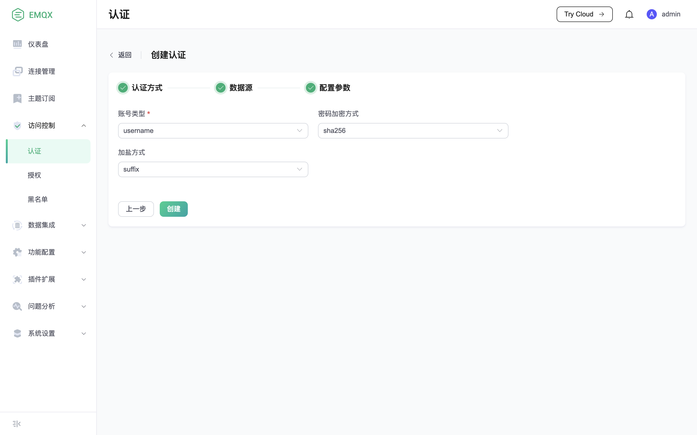

# 使用内置数据库（Mnesia）的密码认证

EMQX 支持使用内置数据库（Mnesia）作为客户端身份凭据的存储介质，无需用户额外部署其他数据库，能够做到开箱即用。使用内置数据库也是 EMQX 的默认推荐方案，因为它为身份验证提供了最佳性能。

## 认证原理

密码认证通常需要由用户提供身份 ID 和对应的密码，身份 ID 用于标识用户的身份，可以是用户名、客户端标识符或者证书通用名称等。身份 ID 与密码的正确组合，只在用户和认证系统之间共享，因此认证系统可以通过比较用户提供的密码和存储在自己数据库中的密码来验证用户所声明身份的真实性。

### 避免存储明文密码

为了完成身份验证，用户与认证系统之间需要共享一些信息，例如密码。但这意味着原本应该保密的密码现在被多方持有，这会显著增加密码泄漏的概率，因为攻击者攻击任意一方都有可能窃取到密码。

因此，我们不建议在认证系统的数据库中以明文的形式存储密码。因为一旦遭遇拖库，这些密码将完全暴露在攻击者面前。我们更建议生成一个随机的盐，然后在数据库中存储这个盐和对密码加盐后散列得到的值。这样即便攻击者窃取到了数据库中的数据，他既不能拿着这个散列值来进行登录，也很难根据散列值反推出真正的密码。

## 创建使用内置数据库的密码认证

您可以使用 EMQX Dashboard 来创建使用内置数据库的密码认证。

在 [Dashboard > 访问控制 > 认证](http://127.0.0.1:18083/#/authentication) 页面单击**创建**，选择**认证方式**为 `Password-Based`，**数据源**为 `Built-in Database`，然后就会进入具体的配置页面：

**账号类型**用于指定 EMQX 应当使用哪个字段作为客户端的身份 ID 进行认证，可选值有 `username` 和 `clientid`。对于 MQTT 客户端来说，分别对应 CONNECT 报文中的 Username 和 Client Identifier 字段。

**密码加密方式**用于指定存储密码时使用的散列算法，支持 md5、sha、bcrypt、pbkdf2 等。对于不同的散列算法，内置数据库密码认证器会有不同的配置要求：

1. 配置为 md5、sha 等散列算法时，对应将有以下配置：

   - **加盐方式**，用于指定盐和密码的组合方式：在密码尾部加盐还是在密码头部加盐。只有在用户需要将凭据从外部存储迁移到 EMQX 内置数据库中时，才可能需要更改这一选项。

2. 配置为 bcrypt 算法时，对应将有以下配置：

   - **Salt Rounds**，又称成本因子，用于指定散列需要的计算次数（2^Salt Rounds）。每加一，散列需要的时间就会翻倍，需要的时间越长，暴力破解的难度就越高，但相应的验证用户需要花费的时间也就越长，因此需要按照您的实际情况进行取舍。

3. 配置为 pkbdf2 算法时，对应将有以下配置：

   - **伪随机函数**，用于指定生成密钥使用的散列函数。
   - **迭代次数**，用于指定散列次数。
   - **密钥长度**，指定希望得到的密钥长度。如果未指定，则表示由 **伪随机函数** 决定输出的密钥长度。

## 从外部存储迁移到 EMQX 内置数据库

如果你已经在其他数据库中存储了凭据，但希望迁移到 EMQX 的内置数据库中，我们提供了从 csv 或 json 格式文件批量导入凭据的功能。要了解更多信息，请阅读 [导入用户](./user_management.md#导入用户)。
